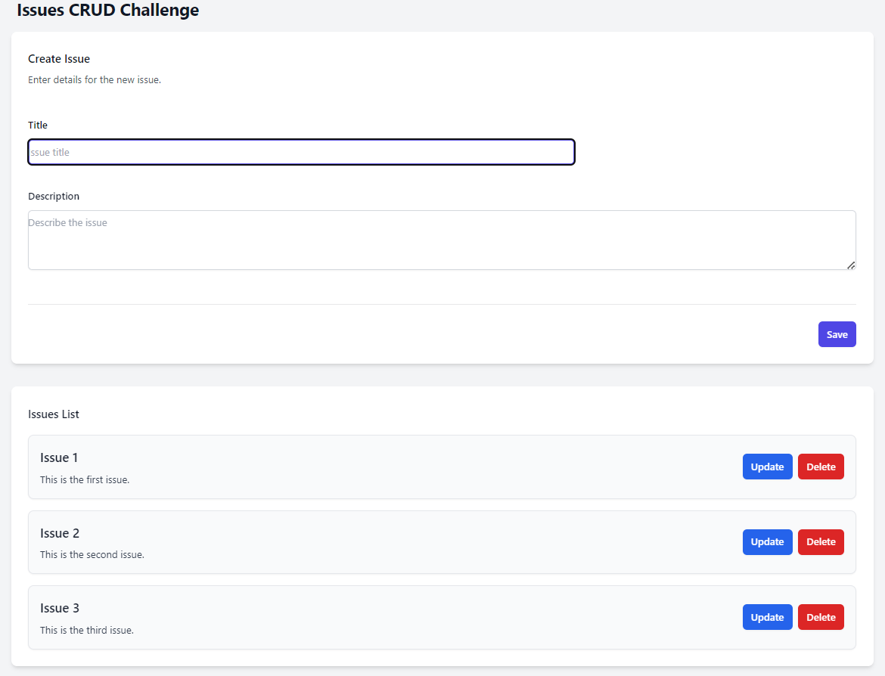

## REST API Server
### Overview

TECH STACK
- Node.js
- Express.js
- Mongo db

## Setup Instructions
create a .env file in the server directory and add the following variables

`DB_URI=<your mongodb uri>`
`PORT=<your port>`

* After navigating to the server directory, run the following command:
`pnpm install`
`pnpm dev`

## REST API Client

### Overview

TECH STACK
- Vite
- React
- Tailwind CSS

## Setup Instructions

create a .env file in the client directory and add the following variables

`VITE_API_URL=<your api url>`

* After navigating to the Client directory, run the following command:
`pnpm install`
`pnpm dev`

Heres how the UI looks like
